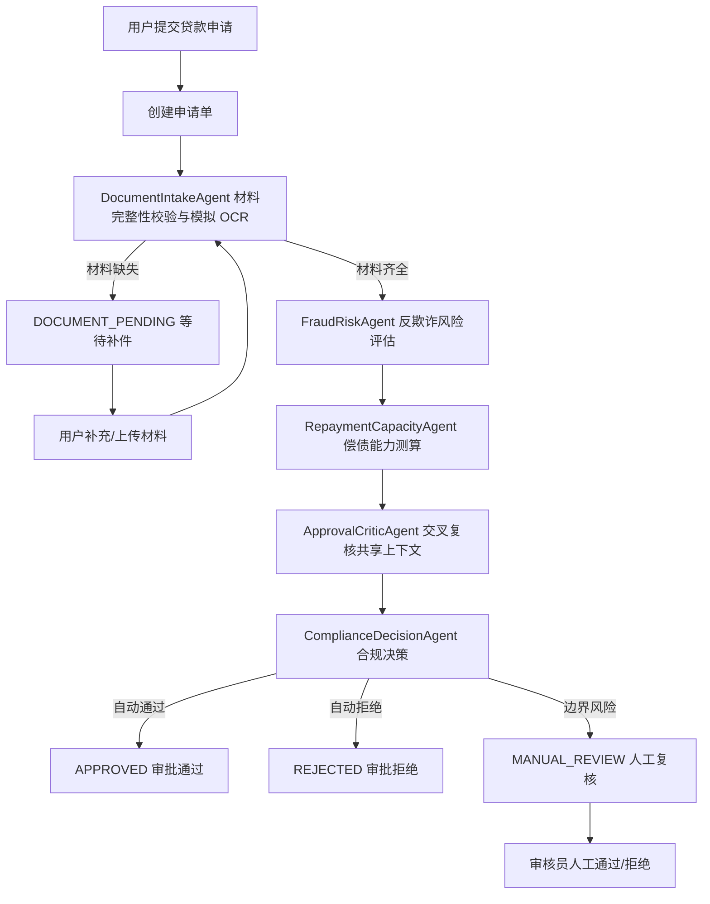

# 智能信贷审批系统（Financial Crisis）

基于 `Spring Boot + Vue 3 + LangChain4j` 的智能信贷审批演示项目。项目围绕“线上贷款申请 -> 材料提交 -> Agent 自动审批 -> 状态追踪 -> 人工复核/审批报告”的主流程搭建，适合用于智能信贷、风控审批、多 Agent 编排、审计留痕等场景的课程设计、项目展示或二次开发。

> 当前版本重点是跑通端到端业务链路：前端提交申请和材料元数据，后端使用本地规则、模拟 OCR 和 DeepSeek 大模型辅助审查完成自动审批编排。数据库、真实文件存储、真实 OCR、征信/反欺诈外部接口和正式鉴权仍属于后续扩展方向。

## 项目功能

### 用户端功能

- 贷款申请提交：填写申请人姓名、身份证号、手机号、贷款产品、申请金额、贷款期限、就业类型、公司名称、工作年限等信息。
- 申请材料提交：选择身份证正面、身份证反面、银行流水等材料，前端向后端提交文件名、文件大小、文件类型、模拟文件地址等元数据。
- 审批状态查询：查看申请编号、申请人、产品、金额、期限、当前状态、当前步骤和状态时间线。
- 申请记录列表：支持按申请编号、申请人、产品关键字搜索，并按状态筛选申请记录。
- 审批报告查看：申请通过或拒绝后，可查询后端生成的模拟审批报告地址。
- 使用指南、演示登录和个人中心：用于完善前端演示体验，其中登录功能当前为纯前端演示，不调用后端鉴权接口。

### 后端审批能力

- 申请单管理：创建、查询、列表、状态查询。
- 材料管理：接收材料元数据，校验文件类型和大小，驱动审批流程继续执行。
- Agent 编排：由 Supervisor 按顺序协调材料采集、反欺诈风控、偿债能力测算、交叉审查和合规决策等 Agent。
- 多 Agent 协作：通过共享案件上下文传递结构化发现，由 `ApprovalCriticAgent` 检查专业 Agent 之间的边界风险和结论冲突。
- DeepSeek LLM 审查：材料齐全后调用 `deepseek-v4-flash` 对风险结论进行 JSON 格式复核；没有 API Key 或调用失败时自动回退到本地规则。
- 补件判断：材料不完整时进入 `DOCUMENT_PENDING` 状态，等待用户补充材料。
- 自动审批决策：根据风险规则、DTI、推荐额度等指标输出通过、拒绝或人工复核。
- 人工复核：支持管理端查询待复核工单，并执行人工通过或拒绝。
- 审计时间线：聚合状态流转日志、Agent 执行日志、工具调用日志、政策命中记录，形成可回放的审批过程。
- 审批报告：审批结束后生成模拟报告记录和 `memory://` 报告地址。

## 审批流程



## 技术栈

### 后端

| 技术 | 说明 |
| --- | --- |
| Java 17 | 后端开发语言 |
| Spring Boot 3.3.1 | Web 服务、配置管理、应用启动 |
| Spring Web | REST API 接口 |
| Spring Validation | 请求参数校验 |
| LangChain4j 0.35.0 | 大模型/Agent 能力扩展基础配置 |
| MyBatis Spring Boot Starter 3.0.3 | 业务数据的 Mapper 持久化层 |
| MySQL 8 | 贷款申请、审批结果和审计日志的持久化数据库 |
| Lombok | 简化实体、DTO 样板代码 |
| Spring Boot Actuator | 健康检查与基础监控端点 |
| Maven | 后端依赖管理和构建工具 |

### 前端

| 技术 | 说明 |
| --- | --- |
| Vue 3.5 | 前端 UI 框架 |
| Vite 6 | 前端开发服务器和构建工具 |
| Tailwind CSS 3 | 样式与页面布局 |
| lucide-vue-next | 图标组件库 |
| Fetch API | 调用后端 REST 接口 |

## 目录结构

```text
FinancialCrisis
├── pom.xml                         # 后端 Maven 配置
├── src
│   ├── main
│   │   ├── java/com/erbu/financialcrisis
│   │   │   ├── agent               # 审批 Agent：材料、风控、偿债、审查、DeepSeek、合规决策
│   │   │   │   └── collaboration    # 共享案件上下文与结构化 Agent 发现
│   │   │   ├── common              # 统一响应、业务异常
│   │   │   ├── config              # 全局异常处理、LangChain4j 配置
│   │   │   ├── controller          # 用户端和管理端 REST API
│   │   │   ├── domain              # 实体与枚举
│   │   │   ├── dto                 # 请求/响应 DTO
│   │   │   ├── mapper              # MyBatis Mapper 接口
│   │   │   ├── service             # 业务接口与实现
│   │   │   └── store               # 数据库持久化门面
│   │   └── resources
│   │       └── application.yml     # 后端端口、数据源、LLM 配置
│   └── test                        # 后端测试
└── frontend
    ├── package.json                # 前端依赖与脚本
    ├── vite.config.js              # Vite 配置与 /api 代理
    └── src
        ├── components              # 页面组件
        ├── services/api.js         # 后端接口封装
        ├── App.vue                 # 单页应用入口
        └── style.css               # Tailwind 与全局样式
```

## 快速启动

### 环境要求

- JDK 17+
- Maven 3.8+
- Node.js 18+
- npm 9+

### 启动后端

在项目根目录执行：

```bash
mvn spring-boot:run
```

后端默认启动在：

```text
http://localhost:8080
```

健康检查端点：

```text
http://localhost:8080/actuator/health
```

### 启动前端

进入前端目录并安装依赖：

```bash
cd frontend
npm install
npm run dev
```

前端默认启动在：

```text
http://localhost:5173
```

开发环境下，`frontend/vite.config.js` 会把 `/api` 请求代理到 `http://localhost:8080`。

## 配置说明

后端配置文件位于 `src/main/resources/application.yml`。

```yaml
server:
  port: 8080

spring:
  datasource:
    url: ${DB_URL:jdbc:mysql://localhost:3306/financical}
    username: ${DB_USERNAME:root}
    password: ${DB_PASSWORD:}

llm:
  api-key: ${DEEPSEEK_API_KEY:disabled}
  enabled: ${LLM_ENABLED:true}
  base-url: ${DEEPSEEK_BASE_URL:https://api.deepseek.com}
  model: ${DEEPSEEK_MODEL:deepseek-v4-flash}
  timeout-seconds: ${LLM_TIMEOUT_SECONDS:45}
```

DeepSeek 使用 OpenAI 兼容接口，默认 Base URL 为 `https://api.deepseek.com`，模型为 `deepseek-v4-flash`。正式运行前请在本地环境变量或 IDE Run Configuration 中配置 API Key，不要写入仓库：

```bash
export DEEPSEEK_API_KEY="your-local-key"
export LLM_ENABLED=true
mvn spring-boot:run
```

模型只在材料齐全、规则 Agent 已完成初步分析后调用。LLM 结果只能升级为人工复核，不能放宽本地规则的硬性拒绝或人工复核结论；API Key 缺失、超时、接口异常或 JSON 解析失败时，系统自动使用本地规则继续审批。

可通过环境变量覆盖大模型配置：

| 环境变量 | 说明 |
| --- | --- |
| `DEEPSEEK_API_KEY` | DeepSeek API Key，默认不启用真实调用 |
| `LLM_ENABLED` | 是否启用 LLM 审查，默认 `true`；没有 Key 时自动规则兜底 |
| `DEEPSEEK_BASE_URL` | DeepSeek OpenAI 兼容接口地址，默认 `https://api.deepseek.com` |
| `DEEPSEEK_MODEL` | 模型名称，默认 `deepseek-v4-flash` |
| `LLM_TIMEOUT_SECONDS` | 单次 LLM 调用超时时间，默认 45 秒 |

`LangChain4jConfig` 负责创建 DeepSeek 兼容的 `ChatLanguageModel`，`LlmApprovalAgent` 负责拼装最小案件上下文、解析 JSON 结果和执行安全降级。

## API 概览

### 用户端接口

| 方法 | 路径 | 说明 |
| --- | --- | --- |
| `GET` | `/api/loan/applications` | 查询申请列表 |
| `POST` | `/api/loan/applications` | 创建贷款申请 |
| `GET` | `/api/loan/applications/{applicationId}` | 查询申请详情 |
| `GET` | `/api/loan/applications/{applicationId}/status` | 查询申请状态和状态时间线 |
| `POST` | `/api/loan/applications/{applicationId}/documents` | 上传材料元数据 |
| `POST` | `/api/loan/applications/{applicationId}/supplement` | 提交补充材料 |
| `GET` | `/api/loan/applications/{applicationId}/report` | 查询审批报告 |

### 管理端接口

| 方法 | 路径 | 说明 |
| --- | --- | --- |
| `GET` | `/api/admin/reviews/pending` | 查询待人工复核工单 |
| `GET` | `/api/admin/reviews/{applicationId}` | 查询人工复核详情 |
| `POST` | `/api/admin/reviews/{applicationId}/approve` | 人工复核通过 |
| `POST` | `/api/admin/reviews/{applicationId}/reject` | 人工复核拒绝 |
| `GET` | `/api/admin/audit/{applicationId}/timeline` | 查询审计时间线 |

## 核心状态说明

| 状态 | 含义 |
| --- | --- |
| `SUBMITTED` | 申请已提交 |
| `DOCUMENT_PENDING` / `MATERIAL_PENDING` | 等待补充材料 |
| `OCR_PARSING` | 材料解析中 |
| `RISK_ANALYZING` | 风险分析中 |
| `DECISION_PENDING` / `DECISIONING` | 审批决策中 |
| `MANUAL_REVIEW` | 进入人工复核 |
| `APPROVED` | 审批通过 |
| `REJECTED` | 审批拒绝 |
| `ARCHIVED` | 已归档 |

## 当前版本说明

- 当前后端核心数据通过 MyBatis 保存在 MySQL 的 `financical` 数据库中，应用重启后数据仍然保留。
- 当前 Agent 协作上下文在一次审批流程内共享，协作结果通过 Agent 任务日志和审计时间线留痕。
- LLM 调用默认关闭请求/响应日志，避免把申请信息写入普通应用日志；API Key 只从环境变量读取。
- 贷款申请、材料、状态流转、Agent 日志、风险结果、审批决策、人工复核和审批报告均已接入 Mapper SQL。
- 文件上传当前只提交材料元数据，不上传真实文件内容。
- OCR 当前为本地模拟逻辑，材料齐全后会把文档标记为解析成功。
- 前端登录和个人中心为演示功能，尚未接入真实用户体系。
- 审批报告当前生成 `memory://approval-reports/...` 形式的模拟地址，尚未导出真实 PDF。

## 后续扩展方向

- 使用 Flyway 管理数据库版本和初始化数据。
- 接入真实文件上传、对象存储和 OCR 服务。
- 接入征信、黑名单、多头借贷、设备指纹等外部风控数据源。
- 将规则逻辑抽象为规则引擎或可配置策略。
- 引入 RAG，用于政策条款检索、审批解释生成和人工复核辅助。
- 增加用户认证、角色权限和管理后台页面。
- 完善单元测试、接口测试和前端构建流水线。
